## Portfolio Project: AI automation sync: online sale transaction -> ERP -> Accounting
 
### our business test case

```
demonstrate XERO auto COGS weighed average cost  
for case of PO_1 -> SO_1 -> PO_2 -> SO_2,
using API to sync orders from woocommerce and shoplify to ODOO,
and sync PO and SO from ODOO to XERO. 
```

### Introduction: 

流程整理 (Online Store → Odoo → Xero):

```
Online Store
客戶落單付款 → 訂單編號。

Odoo (ERP)
建立 Sale Order / Invoice → Sale Ref ID。
更新庫存 → 減少數量。

Xero (Accounting)

Before Reconcil：

Dr Bank Unconfirmed 
    Cr Sales Unconfirmed

Dr COGS
    Cr Inventory

After Reconcil：

Dr Sales Unconfirmed
    Cr Bank Unconfirmed
Dr Bank
    Cr Sales Confirmed

```

Prototyping Setup:

- setup product item [ Air Purifier ] in ODOO warehouse.

- [PO]: in ODOO, make purchase_order_1, received, for item [ Air Purifier ], QTY=100, Cost=$15.

- sync purchase_order_1 from ODOO to XERO.

- [SO]: SYNC woocommerce orders included item [ Air Purifier ] to ODOO as sale_order_1 Invoiced.

- sync sale_order_1 from ODOO to XERO.

- we observed how COGS for sale_order_1 auto calculated by xero.

- [PO]: in ODOO, make purchase_order_2, received, for item [ Air Purifier ], QTY=100, Cost=$20.

- sync purchase_order_2 from ODOO to XERO.

- [SO]: SYNC shoplify orders included item [ Air Purifier ] to ODOO as sale_order_2 Invoiced.

- sync sale_order_2 from ODOO to XERO.

- we observed how COGS for sale_order_2 changed, due to purchase_order_1 and purchase_order_2 difference in purchase costs, which is auto calculated by xero.

- Our focus is to demo python code to sync sale.order and stock.picking from ODOO to Xero as invoice and COGS, in sync API via payload.


### Screenshot of Prototyping test cases

> ### centralized odoo warehouse: location for woocommerce, is whwoo/Stock. 


> ### make purchase_order_1, item [ Air Purifier ], QTY=100, Cost=$15.

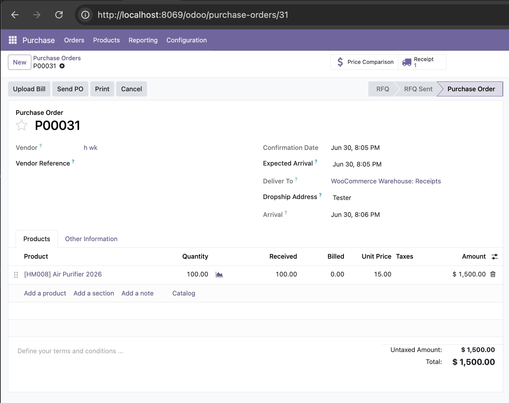

> ### sync purchase_order_1, from ODOO to XERO

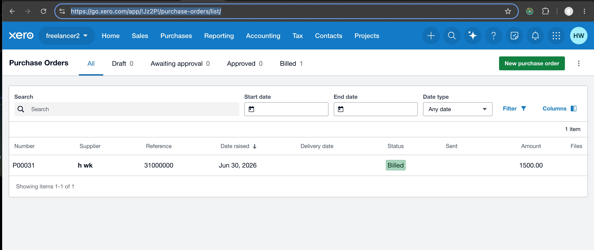

> ### woocommerce online product


> ### woocommerce order list


> ### woocommerce order detail


> ### woocommerce api to sync order to odoo 


> ### odoo sale.order invoice created after sync.


> ### sync sale_order_1 from ODOO to XERO.

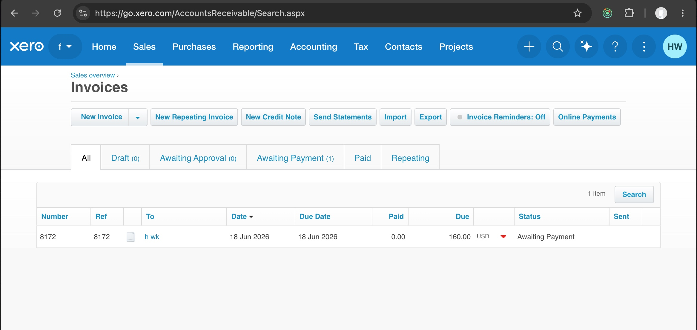

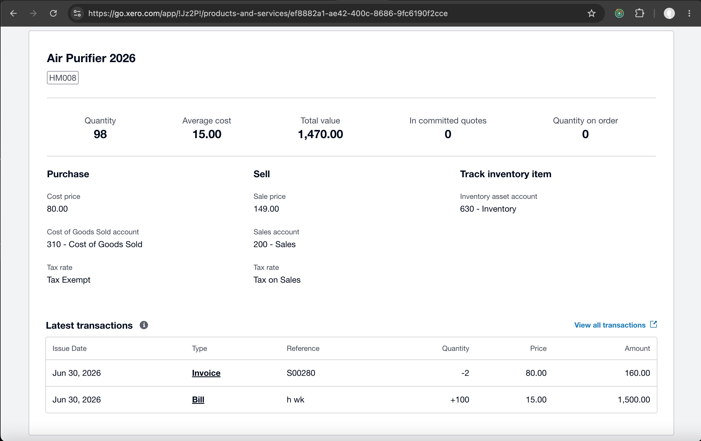
 
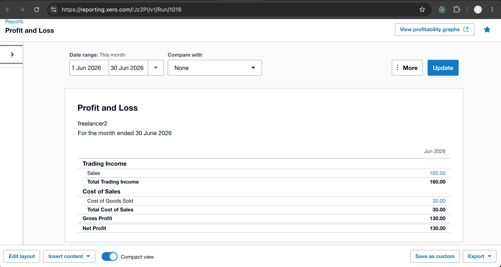


> ### make purchase_order_2, item [ Air Purifier ], QTY=100, Cost=$20.

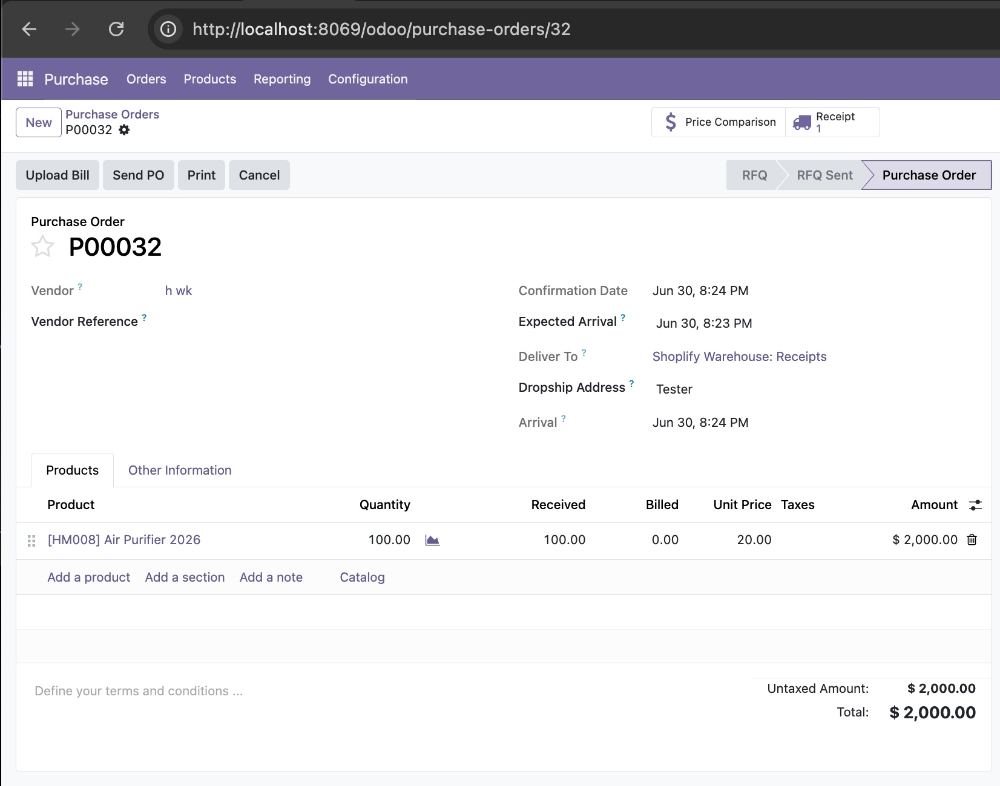

> ### sync purchase_order_2, from ODOO to XERO, note cost of item changed to $17.5253.

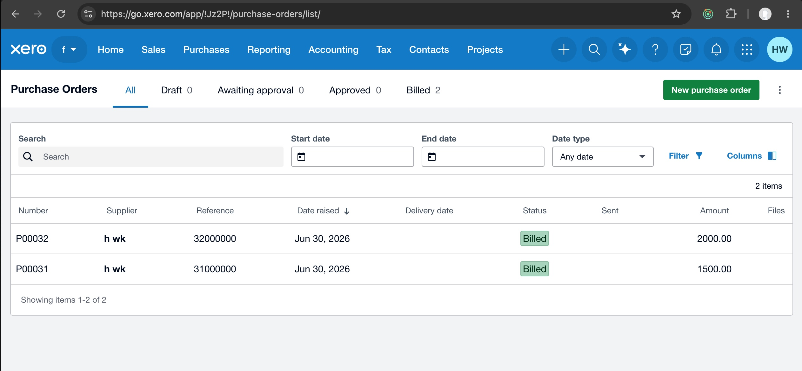

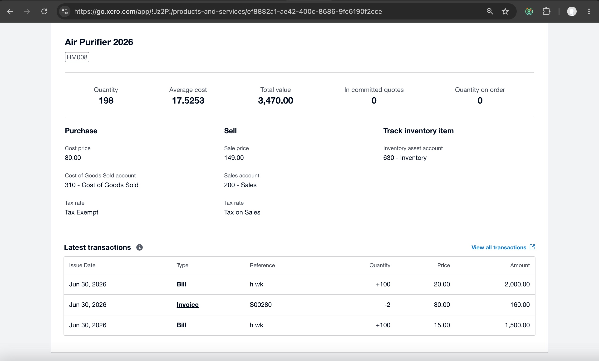

> ### shoplify api to sync order to ODOO, then sync to XERO 

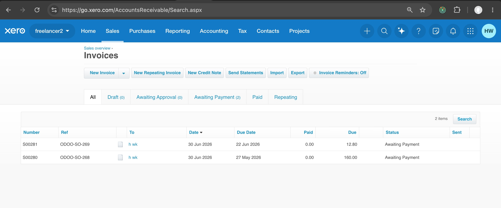

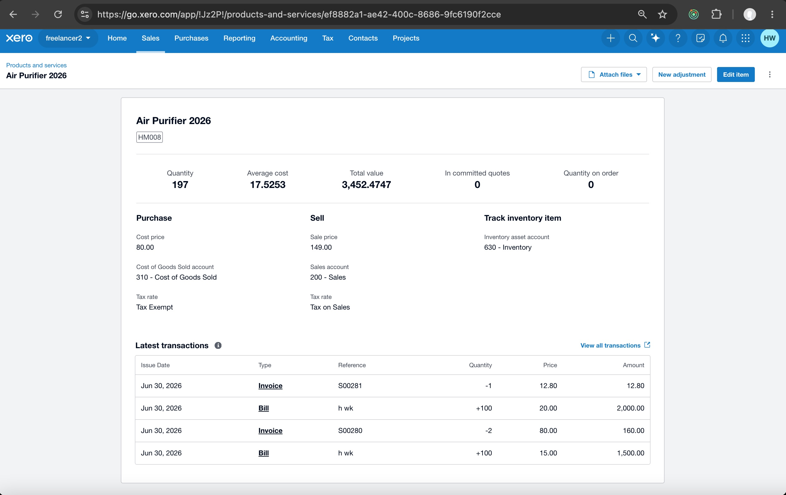
 
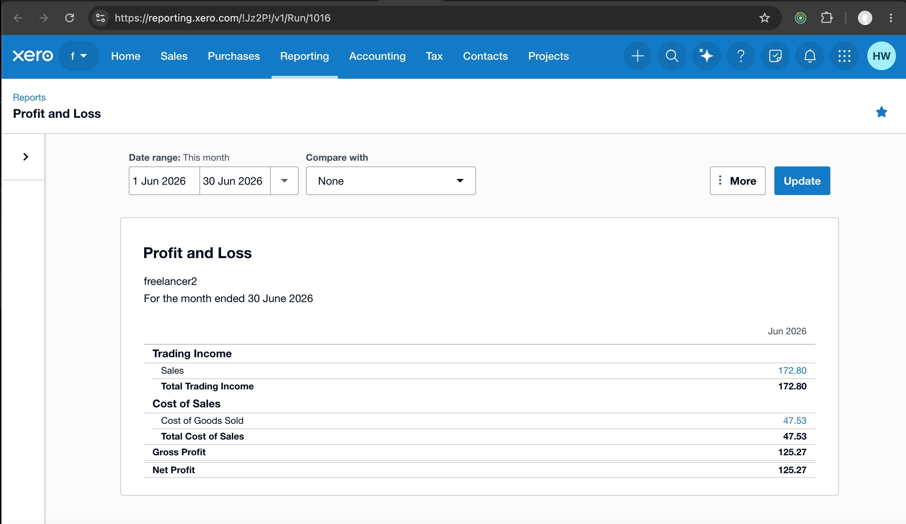


---
---

> ## github repo

### - python unit tests of workflow: 

[https://github.com/cshwk2020/mcp_project/tree/main](https://github.com/cshwk2020/mcp_project/tree/main)

- config.py : all important key configuration such as LLM ApiKey, odoo admin and password, etc.

- xero_config.py : all important key configuration related to xero, such as xero email, xero_username, xero_password, xero_client_id, xero_client_secret.

- mcp_shared/vault_util.py : security hvac utils to get sensitive information such as LLM ApiKey and password from vault instead of hardcode in source code.

- xero_callback_app.py : xero callback to get xero tokens, saved to file xero_tokens.json.

{
    "id_token": "eyJhbGciOiJSUzI1NiIsIm......", 
    "access_token": "xZESqYCoDpUQ5TAVkyf.....", 
    "expires_in": 1800, 
    "token_type": "Bearer", 
    "refresh_token": "uptFuubI................CnX5Rc_By-_yriI", 
    "scope": "openid profile email accounting.invoices accounting.invoices.read ......"
}

- mcp_shared/mcp_odoo_client.py : logic to pull odoo data for sync to xero by other mcp_servers/*.

- mcp_servers/* : structure similar to mcp_servers, loaded by mcp_server_main.py. we did not use LLM to drive our workflow agent because our bz logic need to be deterministic. Instead, we planned to use langgraph workflow to drive our workflow deterministic.

- mcp_servers/mcp_api_sync/* : our core logic for the projects,

- mcp_odoo_sync_woocommerce_service.py : sync from woocommerce orders JSON into odoo sale.order.

- mcp_odoo_sync_shoplify_service.py : sync from shoplify orders JSON into odoo sale.order.

- mcp_xero_sync_contact_service.py: sync contact from odoo into xero, which is needed to relate as vendor with po, etc.

- mcp_xero_sync_item_service.py: sync from odoo products into xero items.

- mcp_xero_sync_po_service.py: sync from purchase order from odoo into xero.

- mcp_xero_sync_so_service.py: sync from sale order from odoo into xero.  

- tests/* : our unit tests of api sync.

- tests/odoo_sync/test_odoo_sync_woocommerce_orders.py : unit test of sync data from woocommerce JSON format into ODOO sale.order.

- tests/odoo_sync/test_odoo_sync_shoplify_orders.py : unit test of sync data from shoplify JSON format into ODOO sale.order.

- tests/test_xero/test_xero_contact_service.py : unit test of sync contacts from ODOO into XERO.

- tests/test_xero/test_xero_sync_products.py : unit test of sync products from ODOO into XERO.

- tests/test_xero/test_xero_sync_po.py : unit test of sync purchase order from ODOO into XERO.

- tests/test_xero/test_xero_sync_so.py : unit test of sync sale order from ODOO into XERO.


### - ODOO module : sync_tracker 
    
beside mcp workflow, there is a ODOO module, sync_tracker module that inherits sale.order, purchase.order and product.template, to keeps record of last_sync_time and sync status for WooCommerce/Shopify/Odoo/Xero integrations, 

[https://github.com/cshwk2020/odoo/tree/19.0/addons/sync_tracker](https://github.com/cshwk2020/odoo/tree/19.0/addons/sync_tracker)

- model/sale_order.py : inherits sale order to add sync related fields for keep track of api sync status.

- model/purchase_order.py : inherits purchase order to add sync related fields for keep track of api sync status.

- model/product_template.py : inherits product template to add sync related fields for keep track of api sync status.

---
---

> ### env setup for XERO before API sync: 

### xero authorize and get back tokens 

```
xero_config.py 
    def build_authorize_url():
    ...

xero_callback_app.py 
    @app.route("/api/sync/odoo2xero", methods=["POST"]) 
    def xero_callback() 
    ...

```

> ### prepare login url to xero authorize for necessary permission. Note that the login is not fixed, it depend on our permisison needs 

```
def build_authorize_url():
    # XERO_AUTHORIZE_BASE_URL  = "https://login.xero.com/identity/connect/authorize"
    
    # Define valid, clean scopes as a list to avoid hidden white-space/newline issues
    scope_list = [
        # OIDC / user
        "openid",
        "profile",
        "email",
        "offline_access",

        # Accounting - confirmed granular scopes
        "accounting.settings",
        "accounting.contacts",
        "accounting.invoices",
        "accounting.payments",
        "accounting.banktransactions",
        "accounting.manualjournals",

        # Reports - confirmed granular scopes
        "accounting.reports.aged.read",
        "accounting.reports.balancesheet.read",
        "accounting.reports.profitandloss.read",
        "accounting.reports.trialbalance.read",

        # Payroll - confirmed scopes
        "payroll.employees",
        "payroll.payruns",
        "payroll.settings",
        "payroll.timesheets",

        # Files, Assets, Projects
        "files",
        "assets",
        "projects",
    ]
 
    params = {
        "response_type": "code",
        "client_id": XERO_CLIENT_ID,
        "redirect_uri": XERO_REDIRECT_URI,
        "scope": " ".join(scope_list),  # Joins cleanly with exactly one space
        "state": "123"
    }
    return f"{XERO_AUTHORIZE_BASE_URL}?{urllib.parse.urlencode(params)}"

```

> ### call build_authorize_url() -> get back login url to xero:

```
https://login.xero.com/identity/connect/authorize?response_type=code
&client_id=BFFAF1576AA9423F833DF4A4730A06C1
&redirect_uri=http%3A%2F%2Flocalhost%3A8000%2Fapi%2Fsync%2Fodoo2xero
&scope=openid+profile+email+offline_access+accounting.invoices+accounting.contacts
&state=...
```

> ### after login success, xero will callback into our flask app and we save tokens to xero_tokens.json, callback url [ via XERO_REDIRECT_URI = "http://localhost:8000/api/sync/odoo2xero" ] , which is set into XERO website,

```
@app.route("/api/sync/odoo2xero", methods=["POST", "GET"])
def xero_callback():
 
    error = request.args.get('error')
    if error:
        return f"Authorization failed: {error}", 400
        
    auth_code = request.args.get('code')
    if not auth_code:
        return "Missing authorization code parameter.", 400

    print(f"\n[INFO] Intercepted valid code value: {auth_code}")
    print("Exchanging authentication token pairs with Xero...")
    
    # XERO_TOKEN_URL = "https://identity.xero.com/connect/token"
    data = {
        "grant_type": "authorization_code",
        "code": auth_code,
        "redirect_uri": XERO_REDIRECT_URI,
        "client_id": XERO_CLIENT_ID,
        "client_secret": XERO_CLIENT_SECRET
    }

    headers = {"Content-Type": "application/x-www-form-urlencoded"}
    response = requests.post(XERO_TOKEN_URL, data=data, headers=headers)
    
    if response.status_code != 200:
        return f"Exchange failed with error string: {response.text}", 400
        
    # Write the returned token payload securely to disk
    TOKEN_FILE = os.path.join(CONFIG_BASE_PATH, "xero_tokens.json")
    with open(TOKEN_FILE, "w") as f:
        json.dump(response.json(), f, indent=4)
        
    print("[SUCCESS] xero_tokens.json successfully created inside local workspace!")
    
    return "<h1>Success! You can close this browser window now. Your xero_tokens.json file has been written to disk.</h1>"


if __name__ == '__main__':
    app.run(port=8000)

```

> ### Xero OAuth2 Token Lifecycle

auth_code -> refresh_token (expired if not used within 60 days)  -> access_token (id_token, expired 30 mins)

auth_code : 一次性，用過一次即失效, 有效期只係幾分鐘。
唔可以用嚟 refresh，純粹第一次換 token。

access_token : 有效期大約 30 分鐘。
用嚟 call API。過期後必須用 refresh_token 換新。

refresh_token : 有效期 60 日。
每次用 refresh_token 換新 access_token，Xero 都會回一個 新 refresh_token。
只要你喺 60 日內 refresh 一次，就會得到新 refresh_token → overwrite 落 tokens.json。
咁樣就可以 無限延續，理論上永遠唔會 expire。

id_token : JWT，包含用戶 profile（email、name 等）。
有效期同 access_token 一樣，大約 30 分鐘。
唔係用嚟 refresh，只係身份資訊。

 
> ### sync ODOO sale.order and stock.picking to XERO

### 設計：extends ODOO to add sync_status, auto set to PENDING when any field changed

```
 class SaleOrder(models.Model):
    _inherit = "sale.order"

    trans_group_id = fields.Char(string="Transaction Group ID", copy=False)
    acct_sync_datetime = fields.Datetime(string="Accounting Sync Datetime")
    acct_sync_id = fields.Char(string="Accounting Sync ID")  # InvoiceID
    sync_status = fields.Selection([
        ("PENDING", "Pending"),
        ("IN_PROGRESS", "In Progress"),
        ("SUCCESS", "Success"),
        ("FAILED", "Failed"),
    ], string="Sync Status", default="PENDING")

   # auto set sync_status to PENDING when any col data changed
   def write(self, vals):
        exception_cols = {"acct_sync_id", "acct_sync_datetime", "sync_status"}
        if any(field not in exception_cols for field in vals.keys()):
            vals["sync_status"] = "PENDING"
        return super(SaleOrder, self).write(vals)


 
class PurchaseOrder(models.Model):
    _inherit = "purchase.order"

    trans_group_id = fields.Char(string="Transaction Group ID", copy=False)
    acct_sync_datetime = fields.Datetime(string="Accounting Sync Datetime")
    acct_sync_id = fields.Char(string="Accounting Sync ID")  # VendorBillID
    sync_status = fields.Selection([
        ("PENDING", "Pending"),
        ("IN_PROGRESS", "In Progress"),
        ("SUCCESS", "Success"),
        ("FAILED", "Failed"),
    ], string="Sync Status", default="PENDING")

    # auto set sync_status to PENDING when any col data changed
    def write(self, vals):
        exception_cols = {"acct_sync_id", "acct_sync_datetime", "sync_status"}
        if any(field not in exception_cols for field in vals.keys()):
            vals["sync_status"] = "PENDING"
        return super(PurchaseOrder, self).write(vals)


class ProductTemplate(models.Model):
    _inherit = "product.template"

    trans_group_id = fields.Char(string="Transaction Group ID", copy=False)
    acct_sync_datetime = fields.Datetime(string="Accounting Sync Datetime")
    acct_sync_id = fields.Char(string="Accounting Sync ID")  # ProductID
    sync_status = fields.Selection([
        ("PENDING", "Pending"),
        ("IN_PROGRESS", "In Progress"),
        ("SUCCESS", "Success"),
        ("FAILED", "Failed"),
    ], string="Sync Status", default="PENDING")

    # auto set sync_status to PENDING when any col data changed
    def write(self, vals):
        exception_cols = {"acct_sync_id", "acct_sync_datetime", "sync_status"}
        if any(field not in exception_cols for field in vals.keys()):
            vals["sync_status"] = "PENDING"
        return super(ProductTemplate, self).write(vals)

```

### payload：PurchaseOrders batch 

```
 {'PurchaseOrders': [
    {
        'PurchaseOrderNumber': 'P00034', 
        'Contact': {
            'ContactID': '17c2e63f-59f8-48ff-b07c-3d297bfd7e73'}, 
        'Date': '2026-07-01 02:11:22', 
        'Status': 'AUTHORISED', 
        'LineItems': [
            {
                'ItemCode': 'HM008', 
                'Description': '[HM008] Air Purifier 2026', 
                'Quantity': 100.0, 
                'UnitAmount': 15.0}], 
        'Reference': '34000000'}]}
```

### payload：Bills batch, needed to turn PO status to billed as Account Payable, and Xero will start taking the PO line items for consideration when auto calculate COGS.

```
 {'Invoices': [
    {
        'Type': 'ACCPAY', 
        'Contact': {
            'ContactID': '17c2e63f-59f8-48ff-b07c-3d297bfd7e73'}, 
        'Date': '2026-07-01', 
        'DueDate': '2026-07-01', 
        'LineItems': [
            {
             'ItemCode': 'HM008', 
             'Description': '[HM008] Air Purifier 2026', 
             'Quantity': 100.0, 
             'UnitAmount': 15.0, 
             'TaxType': 'NONE', 
             'PurchaseOrderLineItemID': '5427719f-b02c-4e25-b957-f38afc3ea154'}], 
        'Status': 'AUTHORISED', 
        'Reference': 'P00034', 
        .......}]}
```


### payload：SaleOrders batch 

```
 {'Invoices': [
    {
        'Type': 'ACCREC', 
        'InvoiceNumber': 'S00283', 
        'Contact': {
            'ContactID': 'dffbe90d-0cd7-419e-8969-f8534242b09a', 
            'EmailAddress': 'cshwk2021@gmail.com'}, 
        'Date': '2026-07-01 02:06:19', 
        'DueDate': '2026-05-27', 
        'Status': 'AUTHORISED', 
        'LineItems': [
            {'ItemCode': 'HM008', 
            'Description': 'Air Purifier 2026', 
            'Quantity': 2.0, 
            'UnitAmount': 80.0, 
            'AccountCode': '200'}], 
        'Reference': 'ODOO-SO-271'}]} 
```

---
---

## Appendix: Next Future Iteration

- For current iteration, we focus in MCP servers for online_store -> odoo -> xero.
 
> ### setup langchain pipeline to call all our sync steps in single call, rather than using tests/*. 

- as we keep create orders in woocommerce and shoplify, our pipeline should be able to continously sync them from ODOO to XERO for bookkeeping, while we left ODOO as centralized operation warehouse.


> ### auto re-allocate product QTY from ODOO to woocommerce and shoplify, 

- ensure no oversell in either online store by locking product QTY in ODOO virtual warehouse of woocommerce and shoplify,

- auto re-allocate product QTY of the ODOO virtaul warehouses if one online store near SOLD OUT and another online store not selling.

