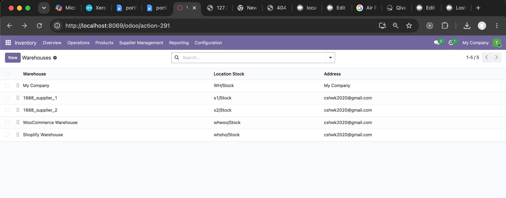
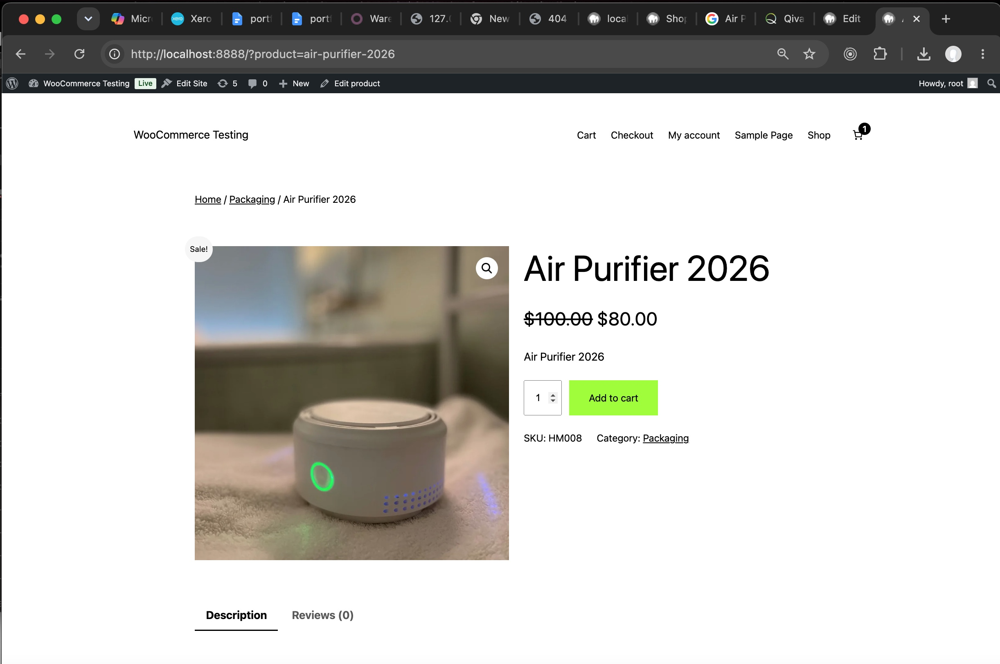
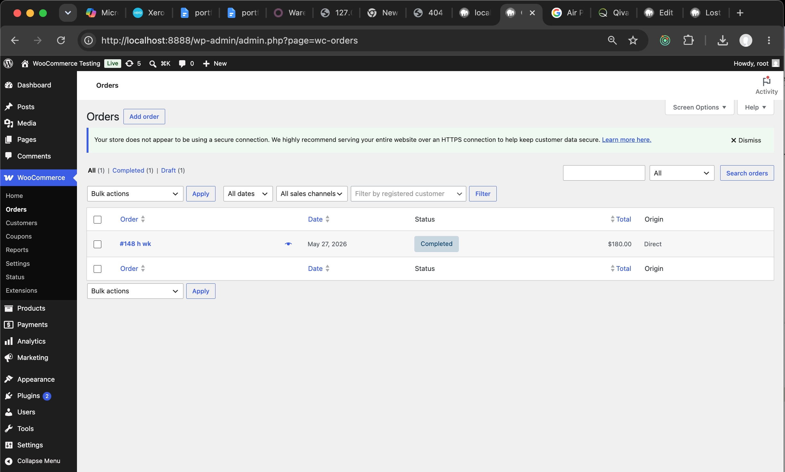
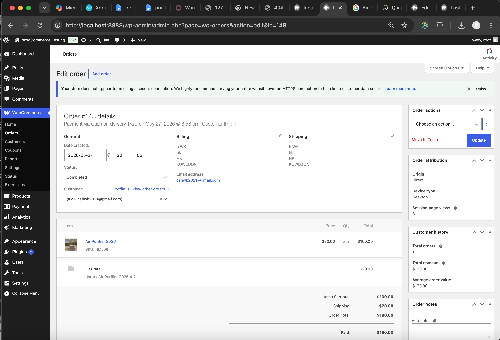
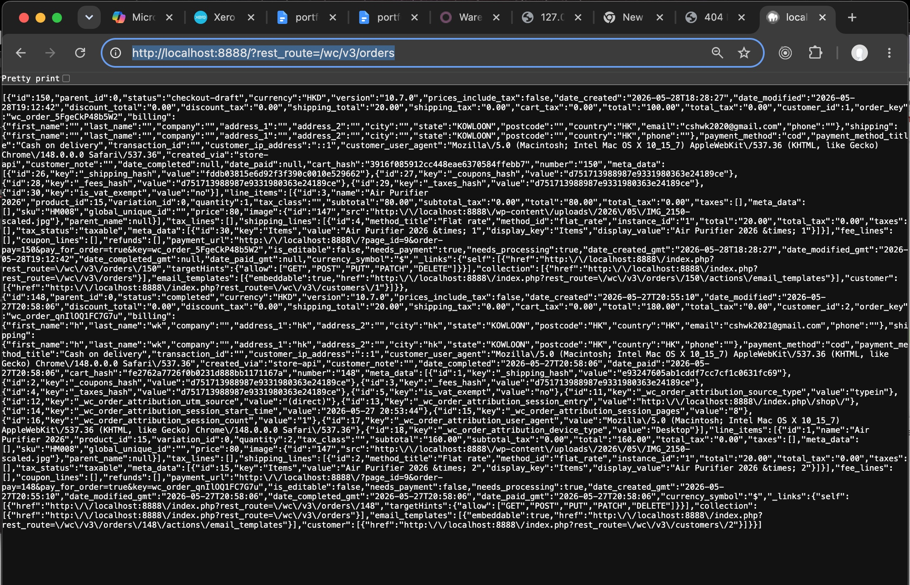
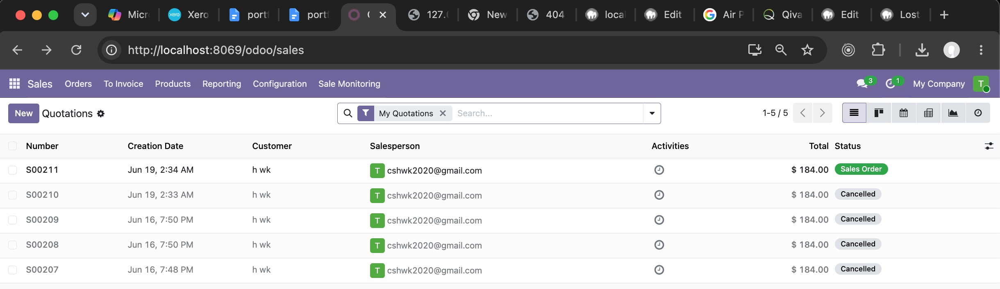
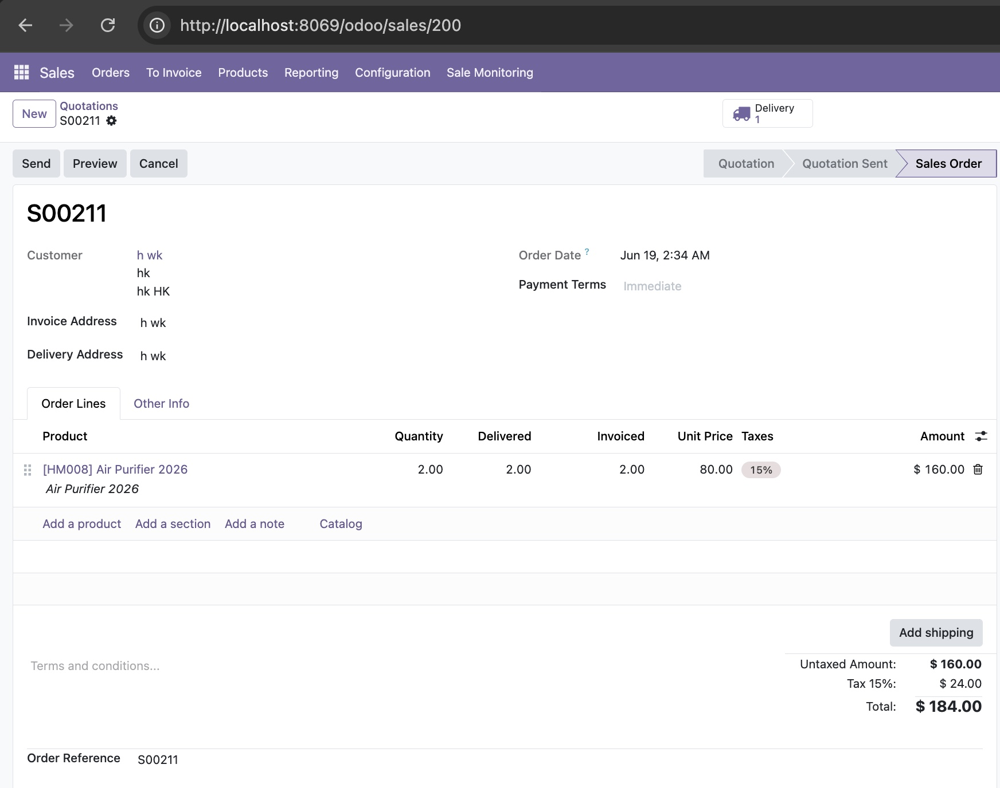
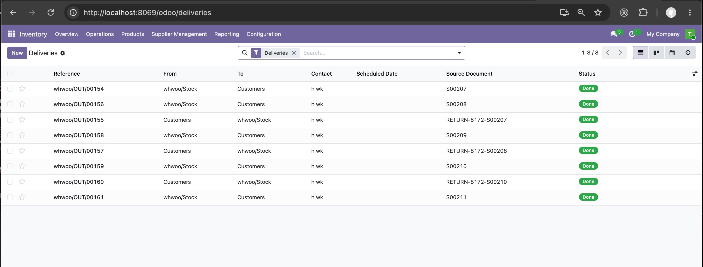
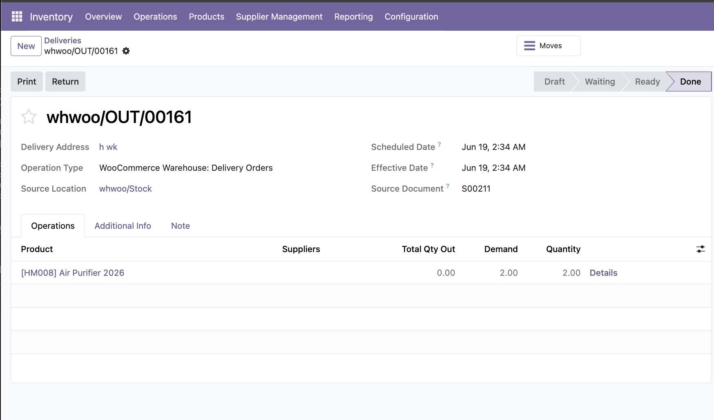
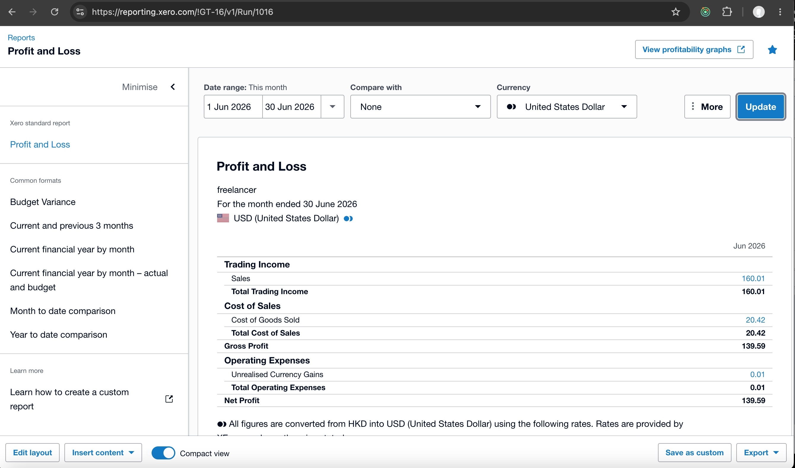

## Portfolio Project: AI automation sync: online sale transaction -> ERP -> Accounting

### our business test case


### Introduction: 

流程整理 (Online Store → Odoo → Xero):

```
Online Store
客戶落單付款 → 訂單編號。

Odoo (ERP)
建立 Sale Order / Invoice → Sale Ref ID。
更新庫存 → 減少數量。

Xero (Accounting)

Before Reconcil：

Dr Bank Unconfirmed 
    Cr Sales Unconfirmed

Dr COGS
    Cr Inventory

After Reconcil：

Dr Sales Unconfirmed
    Cr Bank Unconfirmed
Dr Bank
    Cr Sales Confirmed
     
Back reference：Xero entry 要 refer back Odoo Sale Ref。

```

Prototyping Setup:

- first, we make a online order in woocommerce, paid,

- and then use woocommerce api to sync order into odoo sale order.   

- finally, we sync sale order and stock picking from odoo to xero as invoice and COGS.

- Our focus is to demo python code to sync sale.order and stock.picking from ODOO to Xero as invoice and COGS.


### Screenshot of Prototyping test cases

> ### centralized odoo warehouse: location for woocommerce, is whwoo/Stock. 



> ### woocommerce online product




> ### woocommerce order list



> ### woocommerce order detail



> ### woocommerce api to sync order to odoo 



> ### odoo sale.order list: Instead of overwrite SAME sale order records on resync same order, we cancel previous order and recreate new order, for purpose of leaving as audit trail of history of changes.



> ### odoo sale.order detail 



> ### odoo stock.picking list: Instead of overwrite SAME stock picking records on resync same order, we cancel previous order and create reverse return picking [ from customer to warehouse ], and recreate new order and picking [ from warehouse to customer ] again, for purpose of leaving as audit trail of history of changes.



> ### odoo stock.picking detail 



> ### After sync invoice and picking from ODOO TO XERO invoice and COGS

> ### xero invoice: status is awaiting, as we modelled it as waiting for staff to "bank reconcilation" to verify transaction in bank. 


> ### xero profit and loss report




---
---

> ## github repo

### - python mcp workflow: 

[https://github.com/cshwk2020/mcp_project/tree/main](https://github.com/cshwk2020/mcp_project/tree/main)

- config.py : all important key configuration such as LLM ApiKey, odoo admin and password, etc.

- xero_config.py : all important key configuration related to xero, such as xero email, xero_username, xero_password, xero_client_id, xero_client_secret.

- mcp_shared/vault_util.py : security hvac utils to get sensitive information such as LLM ApiKey and password from vault instead of hardcode in source code.

- xero_callback_app.py : xero callback to get xero tokens, saved to file xero_tokens.json.

{
    "id_token": "eyJhbGciOiJSUzI1NiIsIm......", 
    "access_token": "xZESqYCoDpUQ5TAVkyf.....", 
    "expires_in": 1800, 
    "token_type": "Bearer", 
    "refresh_token": "uptFuubI................CnX5Rc_By-_yriI", 
    "scope": "openid profile email accounting.invoices accounting.invoices.read accounting.manualjournals accounting.manualjournals.read accounting.contacts accounting.contacts.read offline_access"
}

- mcp_servers/* : structure similar to mcp_servers, loaded by mcp_server_main.py. we did not use LLM to drive our workflow agent because our bz logic need to be deterministic. Instead, we use langgraph workflow to drive our workflow.

- mcp_servers/mcp_api_sync/* : our core logic for the projects,

- mcp_odoo_sync_service.py : sync from woocommerce orders JSON into odoo sale.order.

- mcp_xero_sync_service.py: sync from odoo sale.order and stock.picking into xero invoices and COGS. This file is our project focus.

- mcp_clients/* : structure similar to mcp_clients, loaded by mcp_client_main.py. we did not use LLM to drive our workflow agent because our bz logic need to be deterministic. Instead, we use langgraph workflow to drive our workflow. not our project focus.

- mcp_clients/odoo_sync/* : not our project focus.  

- tests/* : our unit tests of api sync.

- tests/odoo_sync/test_odoo_sync_woocommerce_orders.py : unit test of sync data from woocommerce JSON format into ODOO sale.order and stock.picking.

- tests/test_xero/test_xero_flow.py : unit test and integration test of sync data from ODOO sale.order and stock.picking into XERO invoices and COGS. This file is our project focus.


- ### ODOO module : sync_tracker 
    
beside mcp workflow, there is a ODOO module, sync_tracker module that inherits sale.order and stock.picking, to keeps record of last_sync_time and sync status for WooCommerce/Shopify/Xero integrations, 

[https://github.com/cshwk2020/odoo/tree/19.0/addons/sync_tracker](https://github.com/cshwk2020/odoo/tree/19.0/addons/sync_tracker)

- model/sale_order.py : inherits sale.order to add sync related fields for keep track of api sync status.

- model/stocking_picking.py : inherits stock.picking to add sync related fields for keep track of api sync status.

---
---

### Summary of key coding : 

### - extract code snippets

### - start from tests/*

---

### woocommerce tests: 

### - tests/odoo_sync/test_odoo_sync_woocommerce_orders.py 

> ### call MCP server, odoo_sync_service.sync_woocommerce_orders_to_odoo (orders, warehouse_code="whwoo")

```
@pytest.fixture(scope="module")
def odoo_sync_service():
    return MCPOdooSyncService()

def test_sync_woocommerce_orders_full_fields(odoo_sync_service):

    fake_orders = []
    with open("./test_data/woo_order.json") as f:
        fake_orders = json.load(f) 
        print("fake_orders==", fake_orders)

    result = odoo_sync_service.sync_woocommerce_orders_to_odoo(fake_orders, warehouse_code="whwoo")
    print("sync result:", result)

    assert ......
```


### - sync woocommerce orders to odoo

> ### MCPOdooSyncService > sync_woocommerce_orders_to_odoo(orders, warehouse_code="whwoo")

> ### idempotent sync API : _revoke_order + _create_order
```
warehouse_id, lot_stock_id, delivery_type_id = self._get_warehouse_context(warehouse_code)
.......
    results = []
    for order in orders:
        order_ref = str(order.get("id"))
        order_head = map_head(order, warehouse_id)
        order_lines = map_lines(order)
        
        order_status = order.get("status")

        # Skip non-settle statuses
        if order_status not in ("completed", "refunded"):
            print("skip order (status not handled)==", order_status)
            continue

        self._revoke_order(order_ref, delivery_type_id)

        sale_order_id = self._create_order(order, warehouse_id, lot_stock_id, delivery_type_id, .......)

        results.append({
            "order_id": order.get("id"),
            "sale_order_id": sale_order_id,
            "status": "success"
        })
```

> ### MCPOdooSyncService > sync_woocommerce_orders_to_odoo > _revoke_order(order_ref, delivery_type_id):
```
    # client_order_ref is odoo ref back to woocommerce order id

    # ── STEP 1: Find existing sale order (not cancelled) ────────
    existing = self.models.execute_kw(
        ODOO_DB, self.uid, self.odoo_pass,
        "sale.order", "search",
        [[("client_order_ref", "=", order_ref), ("state", "!=", "cancel")]]
    )
     
    if existing and ......:

        sale_order_id = existing[0]

        so_data = self.models.execute_kw(
            ODOO_DB, self.uid, self.odoo_pass,
            "sale.order", "read",
            [[sale_order_id], ["state", "picking_ids"]]
        )[0]
        print("sale_order...so_data == ", so_data)

        so_state = so_data["state"]
        picking_ids = so_data["picking_ids"]
        print("picking_ids == ", picking_ids)

        # ── STEP 2: Reverse all existing pickings ───────────────
        for pid in picking_ids:
            picking = self.models.execute_kw(
                ODOO_DB, self.uid, self.odoo_pass,
                "stock.picking", "read",
                [[pid], ["state","origin","location_id","location_dest_id","partner_id"]]
            )[0]
            print("picking == ", picking)

            if picking["state"] == "done":
                
                # Read sale order name
                so_name = self.models.execute_kw(
                    ODOO_DB, self.uid, self.odoo_pass,
                    "sale.order", "read",
                    [[sale_order_id], ["name"]]
                )[0]["name"]

                # Always create return picking to counter balance cancelled picking
                return_picking_id = self.models.execute_kw(
                    ODOO_DB, self.uid, self.odoo_pass,
                    "stock.picking", "create", [{
                        "origin": f"RETURN-{order_ref}-{so_name}",
                        "picking_type_id": delivery_type_id,
                        "location_id": picking["location_dest_id"][0],
                        "location_dest_id": picking["location_id"][0],
                        "partner_id": picking["partner_id"][0] if picking["partner_id"] else False,
                        "sale_id": sale_order_id,
                    }]
                )
                print("reverse picking......return_picking_id == ", return_picking_id)

                # Reverse stock.moves to counter balance cancelled picking stock.moves
                move_ids = self.models.execute_kw(
                    ODOO_DB, self.uid, self.odoo_pass,
                    "stock.move", "search",
                    [[("picking_id","=",pid)]]
                )
                print("move_ids == ", move_ids)

                moves = self.models.execute_kw(
                    ODOO_DB, self.uid, self.odoo_pass,
                    "stock.move", "read",
                    [move_ids, ["product_id","product_uom_qty","price_unit","description_picking"]]
                )
                print("moves == ", moves)

                for mv in moves:
                    print("create reverse moves......stock.move::create")
                    self.models.execute_kw(
                        ODOO_DB, self.uid, self.odoo_pass,
                        "stock.move", "create", [{
                            "product_id": mv["product_id"][0],
                            "product_uom_qty": mv["product_uom_qty"],
                            "product_uom": 1,
                            "price_unit": mv["price_unit"],
                            "picking_id": return_picking_id,
                            "location_id": picking["location_dest_id"][0],
                            "location_dest_id": picking["location_id"][0],
                            "description_picking": mv["description_picking"],
                        }]
                    )

                # Validate return picking
                self.models.execute_kw(
                    ODOO_DB, self.uid, self.odoo_pass,
                    "stock.picking", "button_validate", [[return_picking_id]]
                )
                print("validate REVERSE PICKING...stock.picking :: button_validate")


            # if picking state NOT done, cancel them......stock.picking::unlink
            elif picking["state"] in ("draft","waiting","confirmed","assigned"):
                
                self.models.execute_kw(
                    ODOO_DB, self.uid, self.odoo_pass,
                    "stock.picking", "action_cancel", [[pid]]
                )
                
                self.models.execute_kw(
                    ODOO_DB, self.uid, self.odoo_pass,
                    "stock.picking", "unlink", [[pid]]
                )

        # ── STEP 3: Cancel old sale order ───────────────────────
        self.models.execute_kw(
            ODOO_DB, self.uid, self.odoo_pass,
            "sale.order", "action_cancel", [[sale_order_id]]
        )

        # ── STEP 4: cancel old order lines ──────────────────────
        line_ids = self.models.execute_kw(
            ODOO_DB, self.uid, self.odoo_pass,
            "sale.order.line", "search",
            [[("order_id","=",sale_order_id)]]
        )
        
        if line_ids:
            self.models.execute_kw(
                ODOO_DB, self.uid, self.odoo_pass,
                "sale.order.line", "write",
                [line_ids, {"name": "[CANCELLED] "}]
            )
```


> ### MCPOdooSyncService > sync_woocommerce_orders_to_odoo > _create_order(order, warehouse_id, lot_stock_id, delivery_type_id, map_head, map_lines):
```
        #
        order_ref = str(order.get("id"))
        order_head = map_head(order, warehouse_id)
        order_lines = map_lines(order)

        sale_order_id = self.models.execute_kw(
            ODOO_DB, self.uid, self.odoo_pass,
            "sale.order", "create", [order_head]
        )
        print("sale.order...create...", sale_order_id, order_head, )

        # ── STEP 6: Create new order lines ─────────────────────────
        for line in order_lines:
            line["order_id"] = sale_order_id
            self.models.execute_kw(
                ODOO_DB, self.uid, self.odoo_pass,
                "sale.order.line", "create", [line]
            )
            print("sale.order.line...create, line==", line)

        # ── STEP 7: Confirm new sale order ─────────────────────────
        self.models.execute_kw(
            ODOO_DB, self.uid, self.odoo_pass,
            "sale.order", "action_confirm", [[sale_order_id]]
        )
        print("sale.order...action_confirm, sale_order_id==", sale_order_id)

        # ── STEP 8: Validate new pickings ──────────────────────────
        new_pickings = self.models.execute_kw(
            ODOO_DB, self.uid, self.odoo_pass,
            "stock.picking", "search",
            [[("sale_id","=",sale_order_id),("state","not in",["done","cancel"])]]
        )
        print("stock.picking::search new_pickings, sale_order_id==", sale_order_id)

        for pid in new_pickings:
            self.models.execute_kw(
                ODOO_DB, self.uid, self.odoo_pass,
                "stock.picking", "action_assign", [[pid]]
            )
            print("stock.picking...action_assign...pid==", pid)
            
            self.models.execute_kw(
                ODOO_DB, self.uid, self.odoo_pass,
                "stock.picking", "button_validate", [[pid]]
            )
            print("stock.picking...button_validate...pid==", pid)

        # ── STEP 9: Mark invoiced qty same as delivered ────────────
        line_ids = self.models.execute_kw(
            ODOO_DB, self.uid, self.odoo_pass,
            "sale.order.line", "search",
            [[("order_id","=",sale_order_id)]]
        )
        print("sale.order.line...search...sale_order_id, line_ids==", line_ids)

        if line_ids:
            lines = self.models.execute_kw(
                ODOO_DB, self.uid, self.odoo_pass,
                "sale.order.line", "read",
                [line_ids, ["qty_delivered","qty_invoiced"]]
            )
            print("sale.order.line::read, lines==", lines)

            for idx, ln in zip(line_ids, lines):
                delivered = ln["qty_delivered"]
                self.models.execute_kw(
                    ODOO_DB, self.uid, self.odoo_pass,
                    "sale.order.line", "write",
                    [[idx], {"qty_invoiced": delivered}]
                )
                print("sale.order.line::write...", idx, "qty_invoiced==", delivered)

        return sale_order_id

```

------

### sync ODOO sale.order and stock.picking to XERO

- ### tests/odoo_sync/test_xero_flow.py 

> ### call MCP server, xero_sync_service.sync_all_transactions(access_token, xero_tenant_id)

```
@pytest.fixture(scope="module")
def xero_sync_service():
    return MCPXeroSyncService()


def test_delete_all_invoices(xero_sync_service):
    global xero_tenant_id, xero_tokens
    refresh_tokens()      
    xero_tokens = load_xero_tokens()  
    access_token = xero_tokens['access_token']       
    xero_tenant_id = connectionAPI()  

    xero_sync_service.delete_all_invoices(access_token, xero_tenant_id)


def test_delete_all_COGS(xero_sync_service):
    global xero_tenant_id, xero_tokens
    refresh_tokens()      
    xero_tokens = load_xero_tokens()  
    access_token = xero_tokens['access_token']       
    xero_tenant_id = connectionAPI()  

    xero_sync_service.delete_all_COGS(access_token, xero_tenant_id)


def test_pull_payloads(xero_sync_service):
    global xero_tenant_id, xero_tokens
    refresh_tokens()      
    xero_tokens = load_xero_tokens()   
    access_token = xero_tokens['access_token']             
    xero_tenant_id = connectionAPI()  

    payloads = xero_sync_service.pull_odoo_sale_orders_and_pickings() 
    print("test_pull_payloads...payloads==", payloads)
 

def test_sync_all_transactions(xero_sync_service):
    #
    global xero_tenant_id, xero_tokens
    refresh_tokens()      
    xero_tokens = load_xero_tokens()  
    access_token = xero_tokens['access_token']              
    xero_tenant_id = connectionAPI()  
    #
    xero_sync_service.delete_all_invoices(access_token, xero_tenant_id)
    xero_sync_service.delete_all_COGS(access_token, xero_tenant_id)
    #
    xero_sync_service.sync_all_transactions(access_token, xero_tenant_id)

```

### xero authorize and get back tokens 

- ### xero_config.py ( build_authorize_url ) and xero_callback_app.py ( @app.route("/api/sync/odoo2xero", methods=["POST"]) def xero_callback() ... )

> ### prepare login url to xero authorize for necessary permission. Note that the login is not fixed, it depend on our permisison needs 

```
def build_authorize_url():
    # XERO_AUTHORIZE_BASE_URL  = "https://login.xero.com/identity/connect/authorize"
    
    # Define valid, clean scopes as a list to avoid hidden white-space/newline issues
    scope_list = [
        "openid",
        "profile",
        "email",
        "offline_access",
        "accounting.invoices",   
        "accounting.invoices.read", 
        "accounting.manualjournals",
        "accounting.manualjournals.read",
        "accounting.contacts",
        "accounting.contacts.read",
    ]
 
    params = {
        "response_type": "code",
        "client_id": XERO_CLIENT_ID,
        "redirect_uri": XERO_REDIRECT_URI,
        "scope": " ".join(scope_list),  # Joins cleanly with exactly one space
        "state": "123"
    }
    return f"{XERO_AUTHORIZE_BASE_URL}?{urllib.parse.urlencode(params)}"

```

> ### call build_authorize_url() -> get back login url to xero:

```
https://login.xero.com/identity/connect/authorize?response_type=code
&client_id=BFFAF1576AA9423F833DF4A4730A06C1
&redirect_uri=http%3A%2F%2Flocalhost%3A8000%2Fapi%2Fsync%2Fodoo2xero
&scope=openid+profile+email+offline_access+accounting.invoices+accounting.contacts
&state=...
```

> ### after login success, xero will callback into our flask app and we save tokens to xero_tokens.json, callback url [ via XERO_REDIRECT_URI = "http://localhost:8000/api/sync/odoo2xero" ] , which is set into XERO website,

```
@app.route("/api/sync/odoo2xero", methods=["POST", "GET"])
def xero_callback():
 
    error = request.args.get('error')
    if error:
        return f"Authorization failed: {error}", 400
        
    auth_code = request.args.get('code')
    if not auth_code:
        return "Missing authorization code parameter.", 400

    print(f"\n[INFO] Intercepted valid code value: {auth_code}")
    print("Exchanging authentication token pairs with Xero...")
    
    # XERO_TOKEN_URL = "https://identity.xero.com/connect/token"
    data = {
        "grant_type": "authorization_code",
        "code": auth_code,
        "redirect_uri": XERO_REDIRECT_URI,
        "client_id": XERO_CLIENT_ID,
        "client_secret": XERO_CLIENT_SECRET
    }

    headers = {"Content-Type": "application/x-www-form-urlencoded"}
    response = requests.post(XERO_TOKEN_URL, data=data, headers=headers)
    
    if response.status_code != 200:
        return f"Exchange failed with error string: {response.text}", 400
        
    # Write the returned token payload securely to disk
    TOKEN_FILE = os.path.join(CONFIG_BASE_PATH, "xero_tokens.json")
    with open(TOKEN_FILE, "w") as f:
        json.dump(response.json(), f, indent=4)
        
    print("[SUCCESS] xero_tokens.json successfully created inside local workspace!")
    
    return "<h1>Success! You can close this browser window now. Your xero_tokens.json file has been written to disk.</h1>"


if __name__ == '__main__':
    app.run(port=8000)

```

> ### Xero OAuth2 Token Lifecycle

auth_code -> refresh_token (expired if not used within 60 days)  -> access_token (id_token, expired 30 mins)

auth_code : 一次性，用過一次即失效, 有效期只係幾分鐘。
唔可以用嚟 refresh，純粹第一次換 token。

access_token : 有效期大約 30 分鐘。
用嚟 call API。過期後必須用 refresh_token 換新。

refresh_token : 有效期 60 日。
每次用 refresh_token 換新 access_token，Xero 都會回一個 新 refresh_token。
只要你喺 60 日內 refresh 一次，就會得到新 refresh_token → overwrite 落 tokens.json。
咁樣就可以 無限延續，理論上永遠唔會 expire。

id_token : JWT，包含用戶 profile（email、name 等）。
有效期同 access_token 一樣，大約 30 分鐘。
唔係用嚟 refresh，只係身份資訊。

 

### sync ODOO sale.order and stock.picking to XERO

> ### 設計：Head + Detail 雙層同步

```
Header = Transaction entry → Xero可以有乾淨嘅「主交易」。
Detail = Backing lines → Xero entry背後有正確數量/金額。

Sale Order (Header): 
作為一個「交易 entry」推去 Xero。
提供交易識別（order_ref、日期、客戶）。
係 Xero 嘅主 entry。

Sale Order Line (Detail):
支持 revenue entry。
每個 line item → Xero invoice line。
保證收入正確。

Stock Picking (Header):
作為物流 transaction entry。
提供出貨單識別（picking_ref、日期、倉庫）。
唔直接產生會計 entry，但係 transaction grouping。

Stock Move (Detail):
支持 COGS entry。
每個 move → Xero inventory/COGS entry。
保證成本正確。
```

> ### 三層狀態再精準定義L pre_sync, sync, post_sync

```
Pre‑Sync:
Odoo entry 已建立，但 未呼叫 Xero API。
安全狀態，本地可控。

Sync (Hot Status):
Odoo 已呼叫 Xero API，但 未確認成功。
係「熱狀態」：交易已經出咗去，但唔知成功定失敗。
風險：如果 Xero down 或 response失敗，entry會卡住。

Post‑Sync:
Odoo 已檢查 Xero entry，確認成功，並更新 entry 狀態。
最終一致狀態，保存 Xero Ref ID。

處理 Sync 失敗的機制
Validation
定期檢查 Sync entries。
用 Transaction ID 去 Xero 查詢：此 entry 是否存在。

如果查唔到 Xero entry → 更新 Odoo entry狀態回到 Pre‑Sync。
重新排隊，再次呼叫 Xero API。

如果查到 Xero entry存在 → 更新 Odoo entry → Post‑Sync。

Sync = 熱狀態，只係過渡期，唔能長期停留。
如果 Sync 失敗 → 驗證 Xero entry → 不存在就回退到 Pre‑Sync，存在就推進到 Post‑Sync。
咁樣保證 Odoo 同 Xero integration 最終一致，即使有 timeout 或 prolonged down time。
```


> ### ensure sync BOTH sale_orders and related pickings to XERO to keep balance

```
first build sale_order_map that group sale order and related stock picking together 
bt calling pull_odoo_sale_orders_and_pickings,

then call push_sale_orders_to_xero(sale_orders, access_token, tenant_id)
and call push_stock_pickings_to_xero(pickings, access_token, tenant_id)

```


> ### MCPXeroSyncService > sync_all_transactions(access_token, tenant_id)

pull_odoo_sale_orders_and_pickings -> push_sale_orders_to_xero + push_stock_pickings_to_xero

```
    # payloads ensure sync BOTH sale_orders and related pickings in same batch to XERO to keep balance
    payloads = self.pull_odoo_sale_orders_and_pickings()

    sale_orders = payloads.get("sale_orders", []) 
    self.push_sale_orders_to_xero(sale_orders, access_token, tenant_id)

    pickings = payloads.get("pickings", [])   
    self.push_stock_pickings_to_xero(pickings, access_token, tenant_id)
    
    return {"status": "completed"}
```

 

> ### MCPXeroSyncService > pull_odoo_sale_orders_and_pickings(....)  

```

    try:
        # ─── STEP 1: GET LATEST SALE ORDERS BY CLIENT REF ───
        # Notice the outer [ ] enclosing all 3 inner parameters
        so_groups = self.models.execute_kw(
            ODOO_DB, self.uid, self.odoo_pass,
            "sale.order", "read_group",
            [
                [("post_sync", "=", False)],     # Positional 1: Domain
                ["id:max", "client_order_ref"],  # Positional 2: Fields to aggregate
                ["client_order_ref"]             # Positional 3: Groupby array
            ],
            {"lazy": False}                      # Keyword arguments dict
        )


        so_ids = []
        for g in so_groups:
            target_id = g.get("id") or g.get("id_max")
            if target_id:
                so_ids.append(target_id)

        if not so_ids:
            return {"status": "success", "sale_orders": [], "pickings": []}

         
        # Read the full details of ONLY the latest Sale Orders
        sale_orders = self.models.execute_kw(
            ODOO_DB, self.uid, self.odoo_pass,
            "sale.order", "read", 
            [so_ids],                              
            {"fields": ["id", "name", "client_order_ref", "partner_id", "date_order",
                        "order_line", "state", "amount_total", "amount_tax", "currency_id"]}
        )
        

        # ─── STEP 2: CHAIN PICKINGS TO LATEST SO NAMES ───
        latest_so_names = [so["name"] for so in sale_orders if so.get("name")]
        if not latest_so_names:
            return {"status": "success", "sale_orders": [], "pickings": []}

         
        # STEP 2b: 清理舊 pickings with post_sync == True 
        old_pickings = self.models.execute_kw(
            ODOO_DB, self.uid, self.odoo_pass,
            "stock.picking", "search_read",
            [[("origin", "in", latest_so_names), ("post_sync", "=", True)]],
            {"fields": ["id", "origin"]}
        )
 
        # If there are old pickings, clear them out
        for pk in old_pickings:
            self.models.execute_kw(
                ODOO_DB, self.uid, self.odoo_pass,
                "stock.picking", "write", 
                [[pk["id"]], {"active": False}]  
            )

        # Query all pickings belonging to these specific live names with post_sync == False
        pickings = self.models.execute_kw(
            ODOO_DB, self.uid, self.odoo_pass,
            "stock.picking", "search_read",
            [[("post_sync", "=", False), ("origin", "in", latest_so_names)]],
            {"fields": ["id", "origin", "scheduled_date", "date_done", "move_ids", "state", "picking_type_id"]}
        )

        # ─── STEP 3: BUILD TRANSFORMATION MAPS ───
        sale_order_map = {}
        for pk in pickings:
            sale_order_map.setdefault(pk["origin"], []).append(pk)


        sale_order_payloads = []
        picking_payloads = []

        for so in sale_orders:

            pk_list = sale_order_map.get(so["name"], [])
 
            if not pk_list:
                continue

            client_ref = so.get("client_order_ref") or f"SO{so['id']}"
 
            for pk in pk_list:
                invoice_number = str(client_ref)  # 唯一用 client_order_ref
                journal_number = f"{client_ref}00000{pk['id']}"
                journel_reference = f"{client_ref}-PK{pk['id']}"
                line_items = self._get_lineitems_from_sale_order(so)                        
                journal_lines = self._get_journalitems_from_pickling(pk)
                order_id = so["id"]

                # Invoice payload
                sale_order_payloads.append({
                        "order_id": order_id,
                        "Type": "ACCREC",
                        "Contact": {"Name": so["partner_id"][1]},
                        "Date": so["date_order"],
                        "DueDate": so["date_order"],
                        "InvoiceNumber": invoice_number,
                        "CurrencyCode": so["currency_id"][1] if so.get("currency_id") else "HKD",
                        "LineItems": line_items,
                        "Total": so["amount_total"],
                        "TotalTax": so["amount_tax"], 
                        "Status": "AUTHORISED" if so["state"] == "sale" else "VOIDED",
                        "Reference": invoice_number
                })


                # Journal payload
                picking_payloads.append({
                        "order_id": order_id,
                        "picking_id": pk["id"],
                        "Narration": f"COGS for Picking {pk['id']} ({pk['picking_type_id'][1]})",
                        "Date": pk.get("date_done") or pk["scheduled_date"],
                        "JournalNumber": journal_number,
                        "Reference": journel_reference,
                        "JournalLines": journal_lines,
                        "Status": "POSTED" if pk["state"] == "done" else "VOIDED"
                })
 
        final_result = {"status": "success", 
                        "sale_orders": sale_order_payloads, 
                        "pickings": picking_payloads}
         
        return final_result

    except Exception as e:
        logger.error(f"Sync failed: {str(e)}")
        return {"status": "error", "message": str(e)}

```


> ### MCPXeroSyncService > push_sale_orders_to_xero(sale_orders, access_token, tenant_id)

```
    headers = {
        "Authorization": f"Bearer {access_token}",
        "xero-tenant-id": tenant_id,
        "Content-Type": "application/json",
        "Accept": "application/json"
    }

    for payload in payloads:
        invoice = payload 
        invoice_number = invoice["InvoiceNumber"]
        order_id = payload.get("order_id")   # 真正 Odoo sale.order.id

        # 查有冇已存在 Invoice
        # check_url = f"{XERO_INVOICE_URL}?where=InvoiceNumber='{invoice_number}'"
        check_url = (
            f"{XERO_INVOICE_URL}?where=InvoiceNumber=='{invoice_number}' AND Status!=\"VOIDED\""
        )

        check_resp = requests.get(check_url, headers=headers)
        data = check_resp.json()

        if data.get("Invoices"):
            invoice_id = data["Invoices"][0]["InvoiceID"]
            invoice["InvoiceID"] = invoice_id
            update_payload = {"Invoices": [invoice]}
            response = requests.post(XERO_INVOICE_URL, json=update_payload, headers=headers)
        else:
            response = requests.put(XERO_INVOICE_URL, json=payload, headers=headers)


        # 判斷邏輯
        if response.status_code in (200, 201):
            self.update_sale_order_sync_status(order_id, success=True)

        elif response.status_code == 400:
                
            # CASE BY CASE BASIS, need manual troubleshooting
            logger.error(f"manual troubleshooting for order {order_id}")

        elif response.status_code >= 500:
            # 網絡/伺服器錯誤 → 留待重試
            self.update_sale_order_sync_status(order_id, success=False)

        else:
            # 其他情況 → 當失敗
            self.update_sale_order_sync_status(order_id, success=False)

```

> ### MCPXeroSyncService > push_stock_pickings_to_xero(pickings, access_token, tenant_id)

```
    headers = {
        "Authorization": f"Bearer {access_token}",
        "xero-tenant-id": tenant_id,
        "Content-Type": "application/json",
        "Accept": "application/json"
    }

    for payload in payloads:
        journal_number = payload["JournalNumber"]
        picking_id = payload.get("picking_id") 

        # STEP 1: 從 Odoo 讀返之前存嘅 ManualJournalID
        picking = self.models.execute_kw(
            ODOO_DB, self.uid, self.odoo_pass,
            "stock.picking", "read",
            [[picking_id]],
            {"fields": ["acct_sync_id"]}
        )

        if picking:
            existing_id = picking[0].get("acct_sync_id")
            
        else:
            existing_id = False
            

        # STEP 2: 如果有舊 ManualJournalID → 先 VOID 舊 record
        if existing_id and existing_id != "00000000-0000-0000-0000-000000000000":
            print("push_stock_pickings_to_xero...void_payload...")
            void_payload = {
                "ManualJournals": [{
                    "ManualJournalID": existing_id,
                    "Status": "VOIDED"
                }]
            }

            void_resp = requests.post(XERO_MANUAL_JOURNAL_URL, json=void_payload, headers=headers)

        ......

        try:
            response = requests.put(XERO_MANUAL_JOURNAL_URL, json=payload, headers=headers)

            # STEP 4: 判斷邏輯
            if response.status_code in (200, 201):
                resp_json = response.json()
                journals = resp_json.get("ManualJournals", [])
                if journals:
                    new_id = journals[0].get("ManualJournalID")
                    # 儲存新 ManualJournalID 入 Odoo
                    self.update_COGS_sync_status(picking_id, new_id, success=True)

            elif response.status_code == 400:
                # Validation fail → 留待人工檢查
                logger.error(f"manual troubleshooting for picking {journal_number}")

            elif response.status_code >= 500:
                # 網絡/伺服器錯誤 → 留待重試
                self.update_COGS_sync_status(picking_id, None, success=False)

            else:
                # 其他情況 → 當失敗
                self.update_COGS_sync_status(picking_id, None, success=False)


        except Exception as e:   
            print(f"Exception occurred: {e}")
            self.update_COGS_sync_status(picking_id, None, success=False)

```


---
---

## Appendix: Next Future Iteration

- For current iteration, we focus in woocommerce -> odoo -> xero.

>  ### For next iteration, 

> ### add shoplify -> odoo -> xero.

- check that odoo can handle both sync from woocommerce and shoplify, 

> ### auto re-allocate product QTY from ODOO to woocommerce and shoplify, 

- ensure no oversell in either online store by locking product QTY in ODOO virtual warehouse of woocommerce and shoplify,

- auto re-allocate product QTY of the ODOO virtaul warehouses if one online store near SOLD OUT and another online store not selling.

